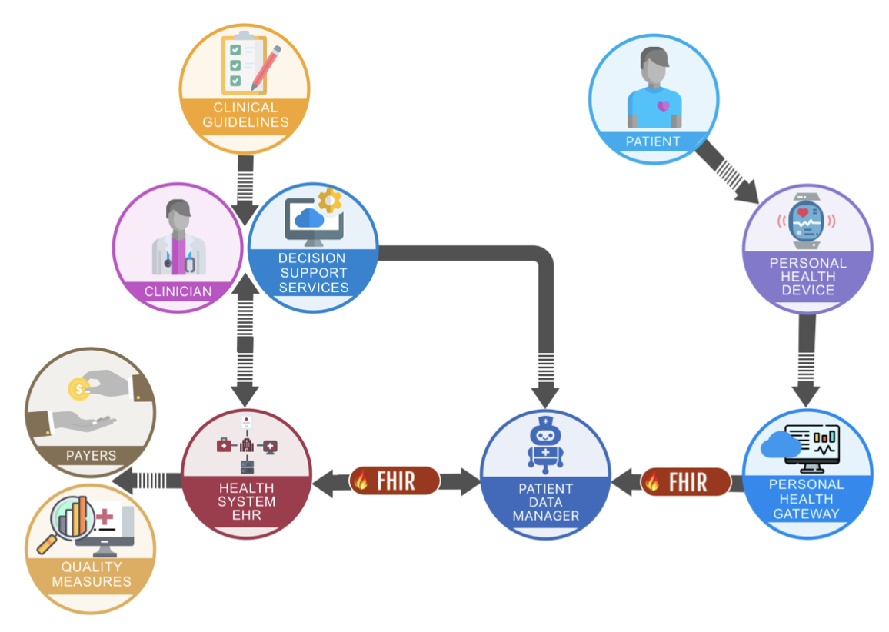

# CardX: Hypertension Management

### Objective

The objective of this implemenation guide is to create an integrated standard that enables interoperable, scalable, and accessible hypertension management both at home and in the clinic. We aim to define the methodology to enable data liquidity between home blood pressure measurement devices, patient data managers, and health systems.

This can potentially improve the awareness of guidelines, identification of disease, and management of individuals with hypertension and increase the proportion of individuals with hypertension who are treated to goal.

### Background

Hypertension affects 115 million adults in America. 85% of African- Americans will develop hypertension in their lifetime. However, there is a lack of adherence to clinical guidelines to diagnose, treat, and manage hypertension. Over 30% of people do not know that they have hypertension and only 25% of patients with a diagnosis of hypertension achieve blood pressure control.

Home blood pressure monitoring is the standard for hypertension monitoring, but there are no standards for interoperability to capture and exchange data from home blood pressure monitoring, the health system, and a personal health record.

Housed within the CodeX member-driven HL7 FHIR Accelerator, the mission of CardX (Cardiovascular data eXchange) is to engage a diverse group of stakeholders in the cardiovascular domain to enable standards-based interoperability in cardiovascular health and healthcare.

CardX follows the approach established by the CodeX FHIR Accelerator. CardX projects center on use cases targeting the collection and sharing of real-world patient clinical data to inform clinical decision-making, evaluate quality and performance, support participation in clinical registries, and contribute to new discovery.

### CardX Use Case

The intended use case for this implementation guide is for the treatment of adult patients with hypertension. This guide will combine provider and patient-collected data to inform the patient's care plan and monitor the progress toward their health goals.

A narrative example of a patient journey and use case for this implementation guide is in the [Use Cases](use-cases.md) page.

### Overview

#### Actors

Diagnosing and treating hypertension requires participation from at least four groups of people: Nurses or MAs, Clinician-Physician/APPs, Dieticians, and the Patient.

| Participant | Initial Encounter | One-Month Follow-up | Two-Month Follow-up | Six-Month Follow-up   |
|    :----:   |    :----:         |       :---:         |       :---:         |       :---:           |
| Nurse/MA    | Demographics, Vital signs, Record home blood pressures in the EHR | Demographics, Vital signs, Record home blood pressures in the EHR   | Demographics, Vital Signs, Medication reconciliation, Record home blood pressures in the EHR | Demographics, Vital signs, Medication reconciliation
| Clinician-Physician/APP   | History and Physical, Review vitals signs, Create orders and document education counseling        | Review labs and blood pressure, Prescribe atorvastatin, chlorthaldione | Review labs and blood pressures, Prescribe potassium and lisinopril, Order follow-up labs | Review labs and blood pressure, counsel |
| Dietician   | Obtain diet history and counsel on low sodium diet | Confirm dietary compliance | 
| Patient     | Record blood pressures and exercise program; Blood pressure measurements are transmitted via a patient portal | Lab draw; Target blood pressure is <120/80, Record blood pressures and exercise program | Lab Draw, Record blood pressures and exercise program | Lab draw |

#### Domains

There are six domains included in this implementation guide:
1. Disease
2. Treatment
3. Outcome
4. Patient
5. Device
6. Assessment

### Contact Information

To learn more about CardX, visit https://confluence.hl7.org/display/COD/Cardiovascular